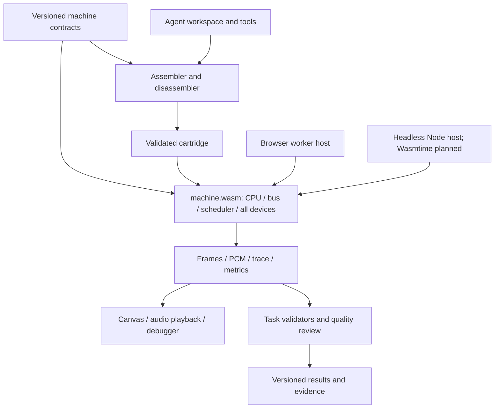

# Machine architecture and planned extensions

The implemented profiles are CPU/video [bootstrap-1](bootstrap-contract.md), CPU/GPU/video [gpu-1](../spec/gpu-1.md), and CPU/GPU/SPU/video [spu-1](../spec/spu-1.md). The profile contracts define current instruction encoding, timing, MMIO, and faults. Cartridge versions 1 and 2 retain their behavior. DMA, general IRQ/timers, snapshots, and a Wasmtime host remain planned extensions. [SPU validation](spu-validation.md) records audio acceptance separately from this design.

## 1. Design intent

The machine should be small enough to learn from a short manual but expressive enough to reward ingenuity. The CPU runs control and sequencing; the micro-GPU and SPU execute guest-written kernels; video scans out pixels. Guest code supplies effects, scene structure, animation, musical sequence, audio algorithms, and composition.

The implemented CPU, memory system, scheduler, GPU, SPU, and video run inside one import-free WebAssembly module. The GPU and SPU share a programmable `g.*` ISA; the host has no built-in drawing or synthesizer service.

Keep three versioned layers independent:

1. **Machine specification:** observable execution, instruction encoding, timing, memory, and devices.
2. **Authoring environment:** assembler, inspection tools, examples, and optional later compilers.
3. **Benchmark protocol:** briefs, budgets, evidence capture, and scoring.

A new task or scoring rubric must not silently change the machine. A convenient browser preview must not introduce a second machine implementation with different semantics.

## 2. Current machine envelope and future benchmark profile

| Property | Proposed default | Purpose |
| --- | --- | --- |
| Cartridge | At most 4,096 payload bytes | Forces code and data economy |
| Mutable RAM | 131,072 bytes, unified | Graphics, audio tables, stack, and working data compete |
| CPU | Sixteen 32-bit integer registers; `r0` is zero | Small, understandable register machine |
| Encoding | 32-bit words, little endian; GPU constants/branches use a following literal word | Simple assembler, decoding, diagnostics, and conformance |
| Arithmetic | Integer CPU; integer and binary32 GPU | Compact fixed-point control and floating-point kernel math |
| Micro-GPU | One 64-lane kernel engine, 32 registers per lane, vector and ray-intersection math | Programmable parallel effects with bounded hardware state |
| Display | 160×120, 60 Hz | Low enough for micro demos; enough room for composition |
| Pixel formats | I1, I2, I4, I8, RGB888 | Explicit memory versus colour tradeoff |
| Palette | Up to 256 RGB888 entries in guest RAM | Palette effects and genuinely 24-bit palette colours |
| Audio | Audio-clocked guest `g.*` kernel; 256 stereo binary32 frames per block at 48 kHz | Guest-programmed synthesis, effects, and mixing in checked RAM |
| Master time | 12,288,000 virtual ticks/second | Integer relationships between CPU, video, and audio |
| Benchmark duration | Usually 12 seconds, specified per task | Fixed virtual duration, including startup |
| Execution | One WASM module in browser worker and Node headless host; Wasmtime planned | Same reference machine bytes in current browser and headless paths |

These values must survive prototype calibration before being frozen. A 4 KiB payload holds at most 1,024 fixed-width instructions before accounting for data. If calibration shows that instruction encoding dominates the challenge, decide on compact encodings **before** publishing v1; do not change encodings midway through a benchmark series.

Fixed-width instructions are the recommended starting point because they keep the first toolchain small. The machine is RISC-like, not RISC-V compatible. A later compact encoding would be a new architecture version.

### Framebuffer arithmetic

At 160×120, tightly packed buffers require:

| Format | One buffer | Two buffers | RAM left after two buffers |
| --- | ---: | ---: | ---: |
| I1 | 2,400 B | 4,800 B | 126,272 B |
| I2 | 4,800 B | 9,600 B | 121,472 B |
| I4 | 9,600 B | 19,200 B | 111,872 B |
| I8 | 19,200 B | 38,400 B | 92,672 B |
| RGB888 | 57,600 B | 115,200 B | 15,872 B |

Palette, stack, audio tables, commands, intermediate kernel buffers, and mutable code consume additional RAM. Two full 256-entry palettes cost another 1,536 bytes. Cartridge ROM is separate and is already subject to its own 4 KiB limit. Framebuffers are ordinary RAM allocations; the VM does not grant hidden VRAM. CPU/device registers are separately specified fixed hardware state, including the GPU's fixed 8,192-byte lane register bank; they are not unbounded scratch storage.

## 3. Cartridge, boot, and address space

A cartridge has a fixed validated 32-byte transport header and a payload. The header contains only machine/profile identifiers, payload length, entry offset, and fixed reserved fields. Reserved bytes must be zero. All programmable content is in the counted payload; there are no metadata strings, asset sidecars, implicit fonts, executable imports, or automatic host decompression.

Load the payload into read-only cartridge memory. Only actual payload bytes are mapped, even though the address window reserves space for future larger profiles. Zero RAM and reset devices. Set the PC to the validated entry, set the conventional stack pointer to the top of RAM, and make all unspecified registers zero. Execution from RAM is permitted, so an agent may write a decompressor or generate code; its bootstrap and compressed bytes count toward the payload cap.

| Address range | Region |
| --- | --- |
| `0x0000_0000–0x0000_3FFF` | Cartridge window; only actual payload is accessible |
| `0x0001_0000–0x0002_FFFF` | 128 KiB read/write/execute RAM |
| `0x000F_0000–0x000F_0FFF` | System identity, virtual clock, run seed |
| `0x000F_1000–0x000F_1FFF` | Reserved for future interrupt controller |
| `0x000F_2000–0x000F_2FFF` | Reserved for future timers |
| `0x000F_3000–0x000F_3FFF` | Micro-GPU |
| `0x000F_4000–0x000F_4FFF` | Reserved for future DMA/blitter |
| `0x000F_5000–0x000F_5FFF` | Video controller |
| `0x000F_6000–0x000F_6FFF` | SPU, accessible in profile 3 only |

Unmapped addresses, reserved register access, unaligned instructions, and invalid load/store alignment produce a deterministic terminal guest fault. Accesses never wrap around a region. MMIO is aligned 32-bit access only; byte/halfword RAM and ROM reads are supported. No disk, network, host clock, filesystem, or general-purpose host calls are visible to the guest.

The run seed is a documented fixed-width value supplied by the harness. Vary it only for tasks that announce seed-dependent behavior. Do not introduce secret runtime parameters that a task never asks the program to handle.

## 4. CPU

Use a small instruction inventory:

- Arithmetic: add, subtract, low-word multiply, signed/unsigned less-than.
- Bitwise: AND, OR, XOR, logical/arithmetic shifts.
- Immediate forms and upper-immediate construction for constants and addresses.
- Memory: signed/unsigned byte and halfword loads, word load, byte/halfword/word stores.
- Control flow: equality/inequality and signed/unsigned conditional branches, relative jump-and-link, register jump-and-link.
- System: wait-for-interrupt and interrupt-return. Debug break is a terminal diagnostic, never a host service.

Prefer compare-and-branch instructions to implicit condition flags. `r15` is the conventional stack pointer, not a hidden hardware stack. All other register conventions belong in a short assembly ABI.

The normative ISA must define bit layouts, immediate ranges, sign extension, PC-relative bases, branch-target checks, and reserved encodings. Unsigned arithmetic wraps modulo 2^32; signed comparison interprets the same bits as two's complement; shift counts use the low five bits. Signed right shift must be explicitly specified. Multiplication produces the low 32 bits. Illegal encodings fault.

Candidate costs are one tick for ALU/branch instructions, four for multiply, two for a RAM/ROM data access instruction, and four for an MMIO instruction. Fetch is included in instruction cost. Interrupt entry/return costs must also be frozen. No caches, speculation, host-dependent stalls, or variable branch prediction.

`WFI` waits for vblank; gpu-1 and spu-1 also wake it on GPU completion. SPU block events do not wake it. Devices and scanout continue while the CPU waits. General vectored interrupt handling remains a future extension.

## 5. Time, ordering, and memory ownership

This is a deterministic abstract machine with specified operation costs, not a simulation of a real electrical bus. Peripheral engines have independent fixed throughput. There is no unspecified contention model.

At the proposed clock rate:

- One frame is 204,800 ticks.
- A frame has 128 lines of 1,600 ticks: 120 visible, eight vertical blanking.
- One audio sample frame spans 256 ticks on the SPU timeline, giving exactly 800 frames per video frame; the SPU generates them in 256-frame blocks every 65,536 ticks.

One scheduler owns all guest time. CPU instructions read operands when issued and commit effects when completed. Device events may occur between issue and completion. Interrupts are taken only between instructions. Faults identify the virtual tick, PC, opcode or device command, address, and reason.

The implemented same-tick order is CPU commit, GPU commit, SPU block event, then video scanout. The reference SPU runs its bounded job atomically at that event without advancing the central machine clock. Future DMA and IRQ events need a separately frozen place in this ordering. A host event loop, wall clock, or unordered collection must never decide guest-visible order.

### Asynchronous operations

The GPU has one active dispatch: the guest writes its MMIO arguments and `START`, which validates and latches ROM code, grid, bindings, and uniforms. It then schedules metered instructions until completion or its dispatch limit. Stores become visible at instruction commits and bindings are released at completion.

The SPU is enabled with `CONTROL=1`, which validates its configuration. At each audio boundary it validates again, samples CPU parameters, checks binding conflicts with any active GPU dispatch, and runs one shared-ISA job with a 65,536-compute-tick quota. The reference job runs atomically at that machine tick. Its finite stereo PCM is validated before the completed block is published; a fault does not publish a partial block.

GPU kernels use immutable ROM code and four checked ROM/RAM bindings. CPU writes into any active RAM binding and reads/fetches from an active read/write binding fault; read-only CPU reads remain allowed. SPU bindings may share read-only ranges with an active GPU job, but any overlap involving a writer faults at the SPU event. Separate used bindings cannot overlap. Future DMA needs its own lease and overlap contract.

These ownership rules avoid ambiguous CPU/device races. Video is an observer and sees memory committed at its scanline event, including partial GPU output; double buffering prevents incomplete images from being presented. The SPU is a writer to guest audio/state buffers, rather than a sound register bank or a passive memory observer.

A GPU dispatch is not a transaction and does not retain a hidden full-frame rollback buffer. A kernel fault terminates the run and may leave partial output for diagnostics. Exact GPU instruction/lane ordering is part of its contract, not an implementation detail.

## 6. Peripherals

### Micro-GPU: programmable kernel processor

The implemented gpu-1 engine has 64 lanes, 32 registers per lane, lane-local PCs and metered execution of PC cohorts. The CPU launches a bounded 2D grid through MMIO, binding RAM/ROM buffers and sixteen uniform parameters. Kernel instructions perform integer/binary32 arithmetic, vec3 math, ray–sphere intersections, and checked buffer loads/stores. A ray-intersection instruction supplies geometry math only: traversal, materials, lighting and reflected paths remain guest kernel code.

Kernel bytes count against the same cartridge allowance as CPU code. Framebuffers, textures, particle state, tables, and kernel scratch arrays all reside in the same 128 KiB RAM. This enables plasma fields, procedural textures, distance-field effects, particle updates, and guest-written rasterizers without adding a built-in effect instruction for each.

The current kernel profile uses divergent lane-local branches with deterministic minimum-PC cohort ordering, one active wave, no local scratchpad, no atomics, and no implicit texture filtering. The [kernel design](gpu-kernels.md) explains the ray-tracing additions and implemented WebGPU lowering; the [gpu-1 contract](../spec/gpu-1.md) specifies current instruction encoding and timing. The ISA is independent of WebGPU, and accelerated preview deliberately relaxes numerical, cross-lane ordering and GPU timing equivalence for speed.

CPU-written demos remain useful compatibility baselines. The GPU ray-tracing example uses counted CPU and kernel code, scene constants, two RAM framebuffers, and an animated point light. The SPU reuses the same ISA for programmable audio; DMA remains deferred. Neither profile adds a drawing-primitive or fixed synthesis service.

### DMA/blitter: movement and reuse (future)

Keep it separate from kernel execution. Support byte fill/copy, strided row copy, and same-format pixel rectangle blits with an optional transparent index. No scaling or rotation initially. Packed pixel alignment, clipping, source/destination stride, and which formats permit a transparency key must be explicit.

Raw copy candidate cost: `16 + bytes_read + bytes_written` ticks; fill is `16 + bytes_written`. A full RGB888 buffer copy therefore costs 115,216 ticks. Pixel blits use a separately frozen cost per tested pixel. DMA cannot target MMIO or recursively submit commands. Invalid strides or an address that crosses mapped memory fail before any write.

One engine supports both byte transfers and blits; their programming contracts share status, submission, lease, and interrupt behavior.

### Video: scanout, colour, and synchronization

Registers configure framebuffer base, row stride, pixel format, palette base, border colour, scanline compare, and pending page configuration. Configuration is validated and latched at vertical blanking; reset displays a black border until a valid first configuration is latched.

Pixel formats define exact byte/bit order, including which packed pixel occupies the high or low bits. RGB888 uses three bytes in R, G, B order. Palette storage is also R, G, B triplets. Indexed formats use the first 2, 4, 16, or 256 entries.

At each visible-line boundary, scanout reads that entire line and the palette values needed for it, producing canonical RGB888 output. Writes after that boundary affect later lines. A line-compare interrupt fires after that line is captured and can prepare following lines. Thus palette raster effects are possible without modeling pixel-level bus contention. Frame completion and vblank interrupt occur at the first blanking line.

Scanout has its own read path and does not consume CPU or DMA transfer ticks. The machine documentation must say this explicitly. Host frame capture is an observer buffer, never guest-readable extra RAM. Browser scaling is nearest-neighbour by default; CRT filters are optional presentation only and excluded from scoring.

### Interrupt controller and timers (future)

Use a small fixed set of interrupt sources: vblank, scanline compare, timer 0/1, GPU completion, and DMA completion. Define pending and mask registers, write-one-to-clear acknowledgement, fixed priority, and one vector base with fixed-size entries.

Only one interrupt is active at a time in v1. Hardware preserves PC and interrupt-enable state in fixed controller state; the handler preserves registers in guest RAM and returns with `IRET`. Events occurring while masked still latch pending status. Repeated events on an already pending source coalesce. Pending sources remain latched until acknowledged.

Timers derive from virtual ticks; periodic expiration uses exact integer deadlines. Specify behavior for zero periods, reconfiguration, and simultaneous acknowledgement/new events. Reading a multiword tick counter must use a documented latch rule.

### SPU: audio-clocked signal compute

The implemented [spu-1 profile](../spec/spu-1.md) runs a guest `g.*` kernel at each 65,536-tick audio block boundary, first at tick 65,536. The CPU configures ROM code, a 1–160 by 1–120 invocation grid, four checked bindings, and fourteen user uniforms. Uniform 14 supplies the current absolute sample-frame index and uniform 15 supplies the 48,000 Hz rate. All oscillation, sampling, envelopes, filters, effects, routing, and mixing are guest code. No voice, oscillator, noise, wavetable, envelope, filter, or mixer register exists.

Each job writes 256 interleaved stereo binary32 frames (2,048 bytes) into guest RAM. Registers reset per invocation; persistent DSP state lives in ordinary RAM bindings. One invocation can loop across time for a recurrent stream, while independent invocations can generate separate samples. The reference interpreter has a 65,536 virtual compute-tick quota per block. PCM must be finite and is clamped to [-1, 1] for output. A disabled SPU emits silence. The bounded 8,192-frame host queue drops new frames on overflow while guest synthesis time continues.

The browser may compile the same binary kernel to WebGPU. Writable-binding reads then use atomic output-memory loads, enabling state recurrence within an invocation; cross-invocation dependencies remain unordered on hardware. WASM is the canonical path for exact behavior and WAV capture. AudioWorklet playback is a separate resampling transport, muted until the user selects **Sound on**. [SPU validation](spu-validation.md) separates reference PCM, hardware execution, browser transport, and listening evidence.

## 7. Implementation boundaries

The implemented machine is Rust targeting portable WebAssembly, with CPU, GPU, SPU, video, and bus linked into `machine.wasm`. The browser Web Worker and Node headless host run the same module bytes. A Wasmtime embedding remains planned. The host shells transport frames/audio and may accelerate validated kernels for preview; canonical device behavior remains in WASM. Official benchmark scoring and pinning remain future work.

The CPU/kernel assembler is linked into the WASM artifact so the browser can assemble and inspect cartridges locally. Authoring does not grant the guest additional instructions or memory. A separate disassembler artifact is future work.

The core has no dependency on browser, provider SDK, task grader, or media encoder. Peripherals communicate through explicit bus, event, lease, and interrupt contracts, never by calling each other's internals. The host supplies immutable run configuration and receives outputs; the evaluation embedding never invokes debug mutations during scored execution.

### WASM containment and host ABI

Compile one module with internal component boundaries first. Separate CPU/GPU/audio WASM instances would add memory sharing and clock synchronization problems without improving this benchmark's guest model. Independent agents can own Rust modules/crates that link into the same WASM artifact.

The current versioned ABI supports reset/load, bounded virtual-tick runs, frame and PCM draining, and bounded CPU/GPU/SPU telemetry. Snapshot/restore is future work. Validated pointer/length buffers and explicit integer/status fields connect the Node and browser hosts. Capture records the exact module hash and ABI version.

Do not require WASI imports for the machine core; no host filesystem, network, entropy, or wall-clock imports. Preallocate and cap WASM linear memory separately from the guest's 128 KiB RAM. The module also needs bounded emulator state, frame/audio output queues, and scratch space; none of that extra memory is guest-addressable. Stream captures to the host rather than accumulating a run inside linear memory. Pause at slice/output limits without advancing extra virtual time, and drain every canonical frame/sample in evaluation.

WASM protects its host boundary, but does not automatically enforce the simulated CPU's address map within the module's linear memory. Every implemented CPU, GPU, SPU, and video access goes through checked virtual-memory views; future DMA must do the same. The machine has no WASM imports. These boundaries follow the [WebAssembly security model](https://webassembly.org/docs/security/), whose protection is at module/linear-memory boundaries rather than arbitrary internal object boundaries.

CPU/GPU virtual instruction costs and the SPU's 65,536-compute-tick block quota are enforced inside the module. They are portable guest limits. A future Wasmtime adapter may add fuel or epoch interruption as a host resource bound; WASM fuel is not a comparable guest-cycle metric. [Wasmtime documents fuel and epoch interruption](https://docs.wasmtime.dev/examples-interrupting-wasm.html).

The worker advances fixed virtual slices, independent of `requestAnimationFrame` or audio-device latency. Canvas displays completed frames. After an explicit **Sound on** gesture, an AudioWorklet plays queued SPU PCM; underruns and device-rate conversion affect presentation only. Browser pause, hidden-tab throttling, or display refresh cannot change the simulated audio/video timeline. The WebGPU fast backend compiles validated GPU and SPU dispatches from guest binary code. Its float results and execution timing may differ by design; canonical captures use the WASM reference. See [the backend contract](gpu-kernels.md#webgpu-acceleration).

Proposed interfaces to freeze, with names illustrative:

| Contract | Responsibility |
| --- | --- |
| `Bus.read/write/fetch(origin, width, address, tick)` | Mapping, permissions, alignment, leases, MMIO routing |
| `Device.read32/write32(offset, value, tick, context)` | Device register behavior; returns effects/faults |
| `Device.on_event(event, context)` | Complete scheduled work without advancing time itself |
| `Scheduler.schedule(tick, priority, device_id, event)` | Deterministic ordered events; bounded pending state |
| `Lease.acquire/read_or_write/release` | Source/destination ownership with checked ranges |
| `Irq.raise(source)` | Pending source notification |
| `Machine.run_until(tick)` | Core execution independent of wall time |
| `Observer.frame/audio/trace/metrics` | Bounded or streaming capture; no guest feedback |
| `Snapshot.save/restore(version)` | RAM, registers, leases, pending jobs/events, scanout, and audio state |

No component may keep an independent notion of elapsed guest time. Snapshot restoration must reproduce uninterrupted execution, including a partially captured frame and any active engine command.

Machine-readable definitions should generate assembler constants, register documentation, and decode metadata. Prose still specifies behavior; hand-audited golden vectors check semantics independently of code generation. Specification files must not contain arbitrary executable code.

## 8. Non-goals and references

Do not begin with a JIT, LLVM backend, hardware implementation, high-level shader compiler, operating system, network device, or multiple incompatible profiles. Kernel assembly and a deterministic WASM interpreter are sufficient for the first programmable GPU.

Related primary references, consulted 2026-09-25:

- [TIC-80 specification](https://tic80.com/learn) provides an example of a constrained audiovisual fantasy computer and explicit memory layout. Its machine and API are not the proposed benchmark target.
- [Uxn project overview](https://wiki.xxiivv.com/site/uxn.html) is a useful reference for a compact portable virtual machine. The proposed register-based architecture is a separate design.
- [RISC-V ISA manual](https://riscv.github.io/riscv-isa-manual/snapshot/spec/) illustrates precise integer ISA semantics and encoding tradeoffs. DB32 does not claim compatibility.
